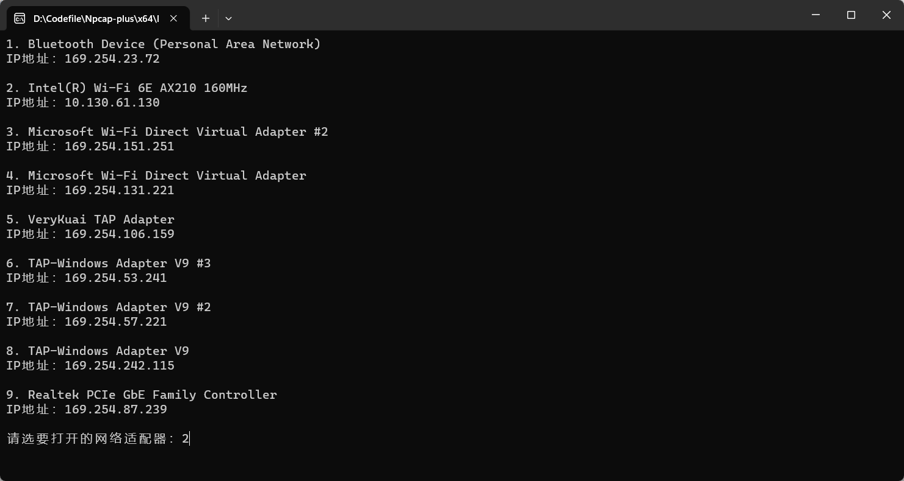
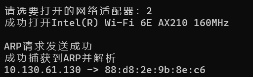
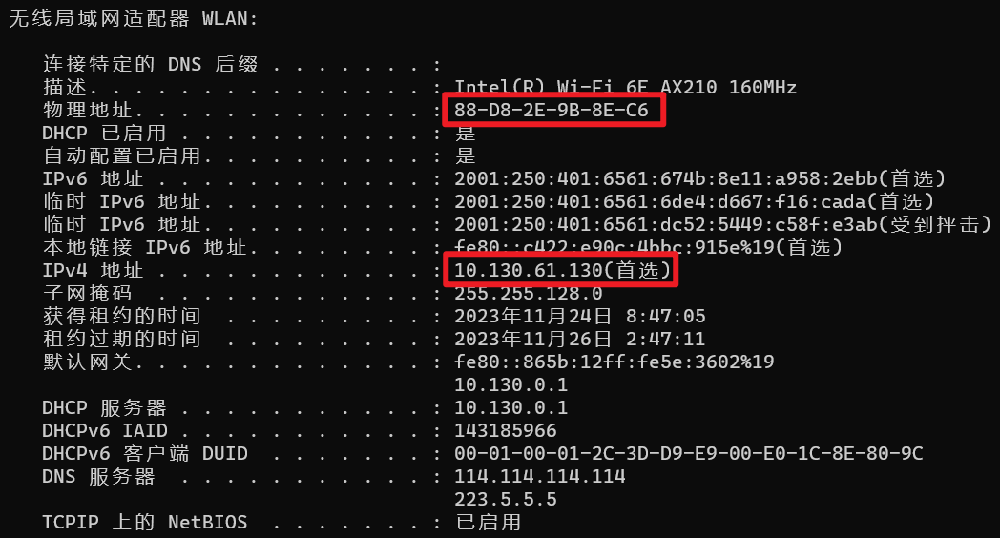
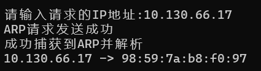
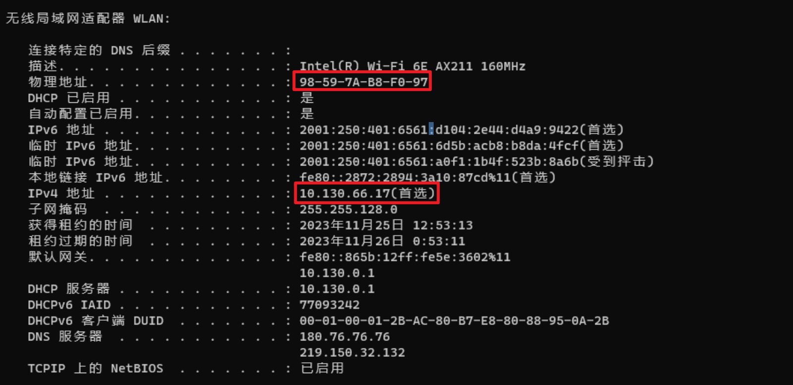

# 网络技术课程实验报告

<center>实验三</center>


<center>实验名称：通过编程获取IP地址与MAC地址的对应关系</center>

<center>梁晓储 2110951</center>

<center>专业：物联网工程</center>

<center>提交日期：2023.11.25</center>


## 一、实验要求

通过编程获取IP地址与MAC地址的对应关系实验，要求如下：

1. 在IP数据报捕获与分析编程实验的基础上，学习NPcap的数据包发送方法。
2. 通过NPcap编程，获取IP地址与MAC地址的映射关系。
3. 程序要具有输入IP地址，显示输入IP地址与获取的MAC地址对应关系界面。界面可以是命令行界面，也可以是图形界面，但应以简单明了的方式在屏幕上显示。
4. 编写的程序应结构清晰，具有较好的可读性。


## 二、数据包发送

`pcap_sendpacket`是libpcap库中用于发送数据包的函数。它可以将一个完整的数据包发送到网络接口上。

```c++
int pcap_sendpacket(pcap_t *p, const u_char *buf, int size);
//其中 p 是 pcap_t 对象，buf 是数据包缓冲区，size 是数据包长度。
//pcap_sendpacket 函数返回 0 表示成功，返回 -1 表示失败。
```


在实验中使用`pcap_sendpacket`发送数据包的步骤如下：

1. 打开网络设备：使用`pcap_open_live`打开要发送数据包的网络设备。这些函数将返回一个`pcap_t`类型的句柄，用于后续的数据包发送操作。
2. 构建数据包：定义了两个结构体，`FrameHeader_t`表示帧首部，`ARPFrame_t`表示ARP帧，填充相应的字段，如目标MAC地址、源MAC地址、IP头部信息等。
3. 发送数据包：调用`pcap_sendpacket`函数发送数据包。该函数接受句柄和数据包缓冲区作为参数，将缓冲区中的数据包发送到网络接口上。


## 三、函数介绍

### printMAC()

```c++
void printMAC(BYTE MAC[6])
{
	for (int i = 0; i < 6; i++)
	{
		if (i < 5)
			printf("%02x:", MAC[i]);
		else
			printf("%02x", MAC[i]);
	}

};
```

 函数用于打印MAC地址。它接受一个长度为6的字节数组作为参数，将每个字节转换成两位的十六进制数，并以冒号分隔的形式输出MAC地址。


### printIP()

```c++
void printIP(DWORD IP)
{
	BYTE* p = (BYTE*)&IP;
	for (int i = 0; i < 3; i++)
	{
		cout << dec << (int)*p << ".";
		p++;
	}
	cout << dec << (int)*p;
};
```

函数用于打印IP地址。它接受一个DWORD类型的IP地址作为参数，将其转换为四个字节表示的IP地址，并以点分十进制的形式输出。


### sendARPPacket()

```c++
void sendARPPacket(pcap_t* pcap_handle, const std::string& srcIP, const BYTE srcMAC[6], const std::string& targetIP, BYTE targetMAC[6]) {
	ARPFrame_t ARPRequest;
	ARPFrame_t* ARPReply;
	struct pcap_pkthdr* pkt_header;
	const u_char* pkt_data;
	char errbuf[PCAP_ERRBUF_SIZE] = {};

	// 组装ARP请求帧
	for (int i = 0; i < 6; i++) {
		ARPRequest.FrameHeader.DesMAC[i] = 0xFF;  // 广播地址
		ARPRequest.FrameHeader.SrcMAC[i] = srcMAC[i];
		ARPRequest.RecvHa[i] = 0;  // 目标MAC（尚未知）
		ARPRequest.SendHa[i] = srcMAC[i];
	}
	ARPRequest.FrameHeader.FrameType = htons(0x0806);  // ARP帧
	ARPRequest.HardwareType = htons(0x0001);  // 以太网
	ARPRequest.ProtocolType = htons(0x0800);  // IP
	ARPRequest.HLen = 6;
	ARPRequest.PLen = 4;
	ARPRequest.Operation = htons(0x0001);  // ARP请求
	DWORD SendIP = ARPRequest.SendIP = inet_addr(srcIP.c_str());
	DWORD TargetIP = ARPRequest.RecvIP = inet_addr(targetIP.c_str());

	// 发送ARP请求
	if (pcap_sendpacket(pcap_handle, (u_char*)&ARPRequest, sizeof(ARPFrame_t)) != -1) {
		cout << "ARP请求发送成功" << endl;
	}

	// 接收ARP回复
	while (true) {
		if (pcap_next_ex(pcap_handle, &pkt_header, &pkt_data) != -1) {
			ARPReply = (ARPFrame_t*)pkt_data;
			if (ARPReply->RecvIP == SendIP && ARPReply->SendIP == TargetIP && ARPReply->Operation == htons(0x0002)) {
				cout << "成功捕获到ARP并解析" << endl;
				printIP(ARPReply->SendIP);
				cout << " -> ";
				printMAC(ARPReply->SendHa);
				cout << endl;

				// 将获取到的目标MAC地址拷贝到传入的 targetMAC
				memcpy(targetMAC, ARPReply->SendHa, 6);
				return;
			}
		}
		else {
			cout << "捕获数据包时发生错误：" << errbuf << endl;
			return;
		}
	}
}
```

函数用于发送ARP请求并接收ARP回复。它接受pcap句柄、源IP地址、源MAC地址、目标IP地址和目标MAC地址作为参数。

首先，函数根据传入的参数组装一个ARP请求帧。

然后，使用`pcap_sendpacket`函数发送ARP请求帧。如果发送成功，输出"ARP请求发送成功"的提示信息。

接着，进入一个无限循环，通过`pcap_next_ex`函数捕获数据包并进行解析。如果捕获到符合条件的ARP回复，则输出"成功捕获到ARP并解析"的提示信息，并打印出发送方IP地址和MAC地址。最后，将获取到的目标MAC地址拷贝到传入的targetMAC数组中，并返回。

如果在捕获数据包时发生错误，输出错误信息并直接返回。


## 四、具体实现

### 导入头文件和库

```c++
#include <Winsock2.h>
#include<Windows.h>
#include<iostream>
#include <ws2tcpip.h>
#include "pcap.h"
#include "stdio.h"
#include<time.h>
#include <cstring>
#pragma comment(lib, "Packet.lib")
#pragma comment(lib,"wpcap.lib")
#pragma comment(lib,"ws2_32.lib")//表示链接的时侯找ws2_32.lib
#pragma warning( disable : 4996 )//要使用旧函数
#define _WINSOCK_DEPRECATED_NO_WARNINGS
using namespace std;
```

这些头文件包括网络编程相关的头文件，以及用于进行网络数据包捕获和处理的 pcap 库。同时，通过`#pragma comment`指令指定了需要链接的库文件。


### ARP报文构造

```c++
struct FrameHeader_t //帧首部
{
	BYTE DesMAC[6];
	BYTE SrcMAC[6];
	WORD FrameType;
};

struct ARPFrame_t//ARP帧
{
	FrameHeader_t FrameHeader;
	WORD HardwareType;
	WORD ProtocolType;
	BYTE HLen;
	BYTE PLen;
	WORD Operation;
	BYTE SendHa[6];
	DWORD SendIP;
	BYTE RecvHa[6];
	DWORD RecvIP;
};
```


定义了两个结构体，`FrameHeader_t`表示帧首部，`ARPFrame_t`表示ARP帧

同时在`sendARPPacket()`中进行定义和组装

```c++
void sendARPPacket(pcap_t* pcap_handle, const std::string& srcIP, const BYTE srcMAC[6], const std::string& targetIP, BYTE targetMAC[6]) {
    
    ARPFrame_t ARPRequest;
    ARPFrame_t* ARPReply;

    // 组装ARP请求帧
    for (int i = 0; i < 6; i++) {
        ARPRequest.FrameHeader.DesMAC[i] = 0xFF;  // 广播地址
        ARPRequest.FrameHeader.SrcMAC[i] = srcMAC[i];
        ARPRequest.RecvHa[i] = 0;  // 目标MAC（尚未知）
        ARPRequest.SendHa[i] = srcMAC[i];
    }
    ARPRequest.FrameHeader.FrameType = htons(0x0806);  // ARP帧
    ARPRequest.HardwareType = htons(0x0001);  // 以太网
    ARPRequest.ProtocolType = htons(0x0800);  // IP
    ARPRequest.HLen = 6;
    ARPRequest.PLen = 4;
    ARPRequest.Operation = htons(0x0001);  // ARP请求
    DWORD SendIP = ARPRequest.SendIP = inet_addr(srcIP.c_str());
    DWORD TargetIP = ARPRequest.RecvIP = inet_addr(targetIP.c_str());
    
}
```

具体组装为

- 设置目的地址为广播地址，源地址为本机MAC地址，帧类型为ARP帧。
- 设置硬件类型为以太网，协议类型为IP，硬件地址长度为6，协议地址长度为4，操作为ARP请求。
- 设置发送方MAC地址、发送方IP地址、接收方MAC地址、接收方IP地址。


至此，成功构造了一个ARP报文。

最后，使用`pcap_sendpacket(pcap_handle, (u_char*)&ARPRequest, sizeof(ARPFrame_t))`将组装好的ARP包发送出去


### 捕获和解析 ARP 回复

在进行捕获之前，先编译过滤器，设置只捕获ARP包

```c++
//编译过滤器，只捕获ARP包
u_int netmask;
netmask = ((sockaddr_in*)(interfaces[num - 1]->addresses->netmask))->sin_addr.S_un.S_addr;
bpf_program fcode;
char packet_filter[] = "ether proto \\arp";
if (pcap_compile(pcap_handle, &fcode, packet_filter, 1, netmask) < 0)
{
    cout << "无法编译数据包过滤器。检查语法";
    pcap_freealldevs(alldevs);
    return 0;
}
//设置过滤器
if (pcap_setfilter(pcap_handle, &fcode) < 0)
{
    cout << "过滤器设置错误";
    pcap_freealldevs(alldevs);
    return 0;
}
```


```c++
while (true) {
    if (pcap_next_ex(pcap_handle, &pkt_header, &pkt_data) != -1) {
        ARPReply = (ARPFrame_t*)pkt_data;
        if (ARPReply->RecvIP == SendIP && ARPReply->SendIP == TargetIP && ARPReply->Operation == htons(0x0002)) {
            cout << "成功捕获到ARP并解析" << endl;
            printIP(ARPReply->SendIP);
            cout << " -> ";
            printMAC(ARPReply->SendHa);
            cout << endl;

            // 将获取到的目标MAC地址拷贝到传入的 targetMAC
            memcpy(targetMAC, ARPReply->SendHa, 6);
            return;
        }
    }
    else {
        cout << "捕获数据包时发生错误：" << errbuf << endl;
        return;
    }
}
```

#### 捕获ARP

首先，代码进入一个无限while循环，表示会一直进行数据包捕获和解析的操作。

在循环内部，使用`pcap_next_ex`函数来获取下一个数据包。该函数的第一个参数是pcap_handle，表示数据包捕获的句柄；第二个参数是pkt_header，用于存储捕获到的数据包的头部信息；第三个参数是pkt_data，用于存储捕获到的数据包的数据内容。

如果`pcap_next_ex`函数返回值不为-1，表示成功捕获到一个数据包，则进入if语句块进行处理。


#### 解析ARP

首先将捕获到的数据包强制转换为`ARPFrame_t`结构体类型，并赋值给ARPReply变量。

然后，通过判断ARPReply结构体中的字段值来确定是否捕获到了目标的ARP回复。条件判断包括：

- `ARPReply->RecvIP == SendIP`：判断接收方IP地址是否与发送方IP地址相匹配。
- `ARPReply->SendIP == TargetIP`：判断发送方IP地址是否与目标IP地址相匹配。
- `ARPReply->Operation == htons(0x0002)`：判断操作码是否为ARP回复（0x0002）。

如果以上条件判断都成立，则表示成功捕获到ARP回复。代码输出一条成功提示信息，并将目标主机的MAC地址拷贝到targetMAC数组中。

最后，通过`memcpy`函数将目标主机的MAC地址拷贝到targetMAC数组中，并返回。

如果`pcap_next_ex`函数返回值为-1，表示在捕获数据包时发生错误。此时，代码输出错误信息并直接返回。


### 获取本机 IP 和 MAC 地址

```c++
string CheatIP = "112.112.112.112";
string LocalIP = {};
string TargetIP = {};

BYTE CheatMAC[6] = { 0x66,0x66,0x66,0x66,0x66,0x66 };
BYTE LocalMAC[6] = {};
BYTE TargetMAC[6] = {};
```

首先定义用于储存IP和MAC的变量，以及设置虚拟的IP和MAC用于向本机发送ARP包以达到获得本机的IP和MAC地址

 ```c++
 sendARPPacket(pcap_handle, CheatIP, CheatMAC, LocalIP, LocalMAC);
 ```

随后调用`sendARPPacket`这个函数，将用于欺骗本机的ARP封装好发送给本机，从而获得本机的IP和MAC地址，储存在`LocalIP`和`LocalMAC`这两个变量中，并且将其打印出来。


### 获取特定IP的MAC地址

```c++
while (true) {
    cout << endl << "请输入请求的IP地址:";
    cin >> TargetIP;
    sendARPPacket(pcap_handle, LocalIP, LocalMAC, TargetIP, TargetMAC);
}
```

在获取到本机的IP和MAC后，继续调用`sendARPPacket`来广播发送ARP包，并且将该ARP包的源IP和源MAC设置为本机IP和本机MAC，同时由用户输入目标IP，这样在后续的捕获过程中就可以通过解析目标IP返回的ARP包解析出目标的MAC地址，达到实验目的。


## 运行结果

### 打开网络适配器，并由用户选择



### 打开特定的网络适配器，并且获取本机IP和本机MAC






### 输入目标IP，并且获取目标MAC





[Github链接](https://github.com/WangshuXC/NetworkTech/tree/main/LAB3)
