# 网络技术课程实验报告

实验四

实验名称：互联网组网与路由器配置

梁晓储 2110951

专业：物联网工程

提交日期：2023.11.27

## 一、实验要求

- 实体环境下互联网组网与路由器配置

在实体环境下完成互联网组网与路由器配置，要求如下：

1. 在机房实验室环境下，通过将局域网划分为不同子网，用多IP主机作为路由器，组建互联网。
2. 在命令行方式下，按照静态路由方式，配置路由器和主机，测试互联网的连通性。

- 仿真环境下的互联网组网与路由器配置

在仿真环境下完成互联网组网与路由器配置，要求如下：

1. 学习路由器的配置方法和配置命令。
2. 参考实体实验，组建由多个路由器组成的互联网。物理网络可以由集线器、交换机构成。
3. 按照静态路由方式配置路由器和主机，测试互联网的连通性。
4. 利用动态路由方式配置路由器和主机，测试互联网的连通性。
5. 在仿真环境的“模拟”方式中观察数据包在互联网中的传递过程，并进行分析。

## 二、实体环境下互联网组网与路由器配置

### 实验环境拓扑图

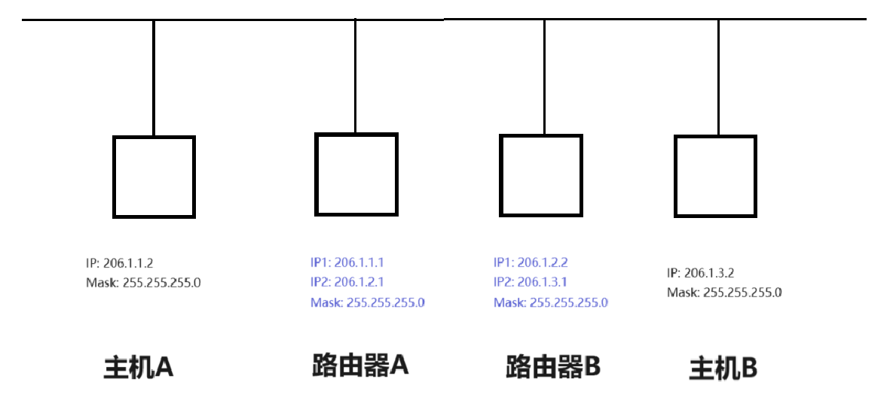

### 主机A和主机B配置

按照`控制面板 -> 网络和Internet -> 网络和共享中心 -> 连接 -> 属性 -> Internet 协议版本 4 (TCP/IPv4) - > 使用下面的IP地址`进行IP配置

将主机A和主机B分别进行如下配置

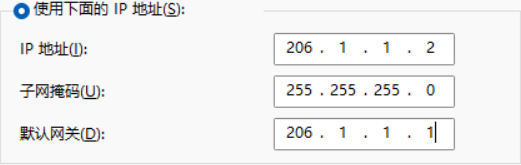

### 路由器A配置

参照`主机A和主机B配置`中的步骤，修改该PC的IP

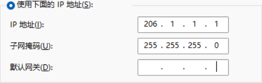

但是因为需要双IP，所以还需要一步操作

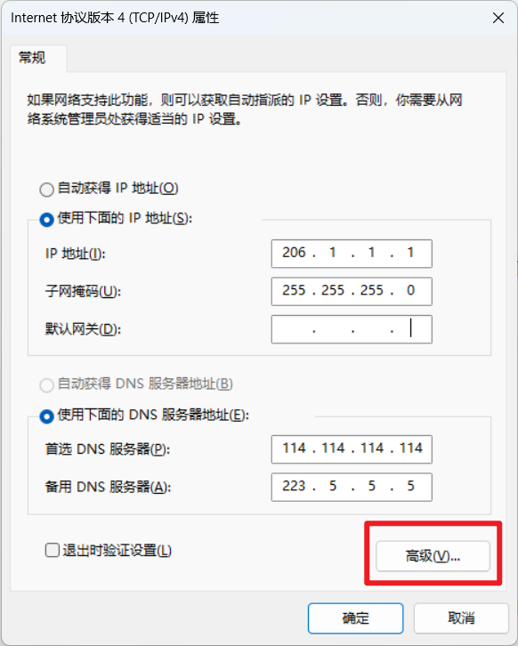

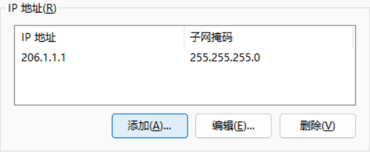

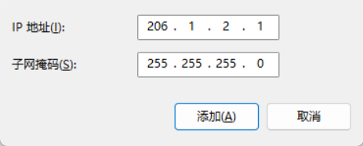

至此，双IP已配置完毕。

接下来使用`Win+X+A`打开管理员终端，输入命令`route print`查看本机接口列表(下图为我个人电脑截图，仅供参考)

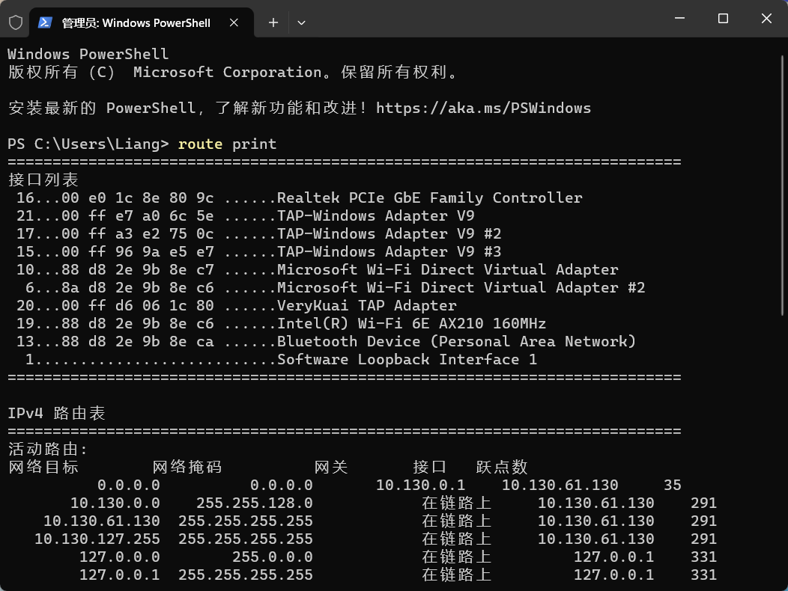

记录下网卡对应的接口列表序号，方便供后续使用

随后输入命令`route add 206.1.3.0 mask 255.255.255.0 206.1.2.2 metric 5 if 6`(此处的6为实验室主机网口对应的接口列表序号)

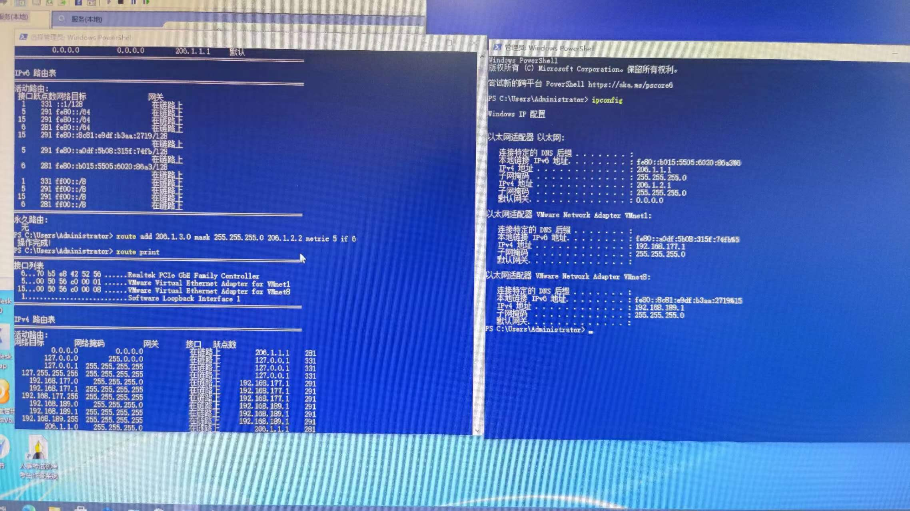

至此，已完成路由器A的配置

### 路由器B配置

步骤和路由器A的配置大同小异，将route命令更换为`route add 206.1.1.0 mask 255.255.255.0 206.1.2.1 metric 5 if 6`

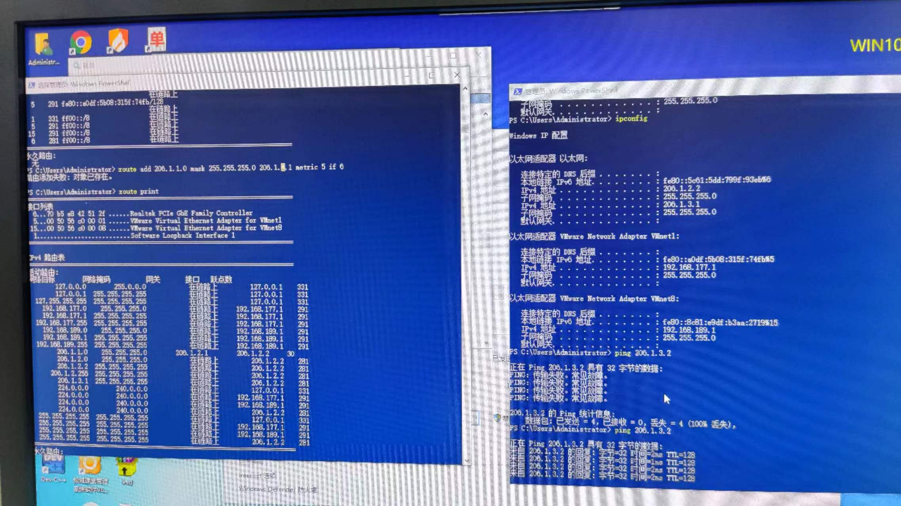

### 结果展示

主机A和主机B互相使用ping命令，测试互联网的连通性

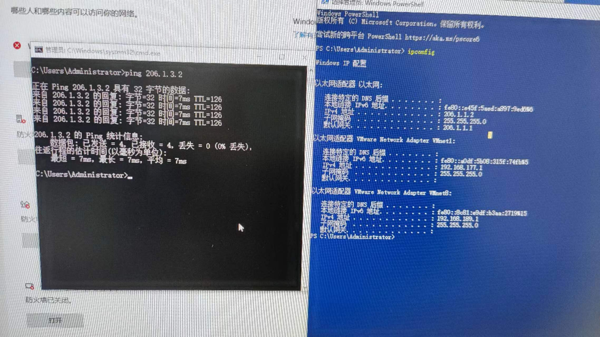

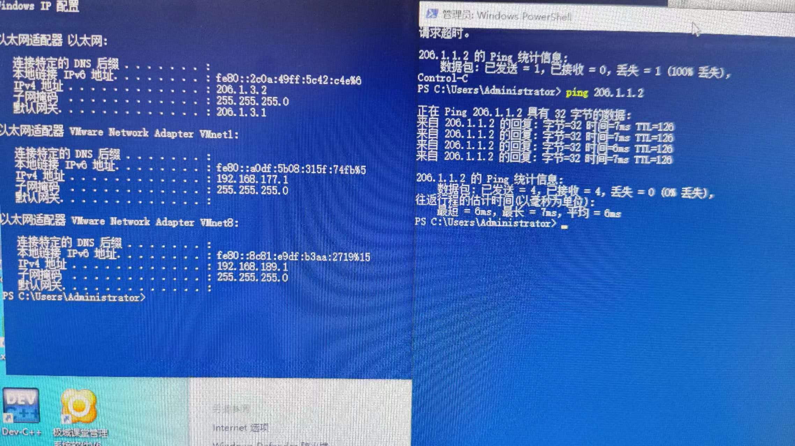

互联网连通性成功验证

## 三、仿真环境下的互联网组网与路由器配置

### 

