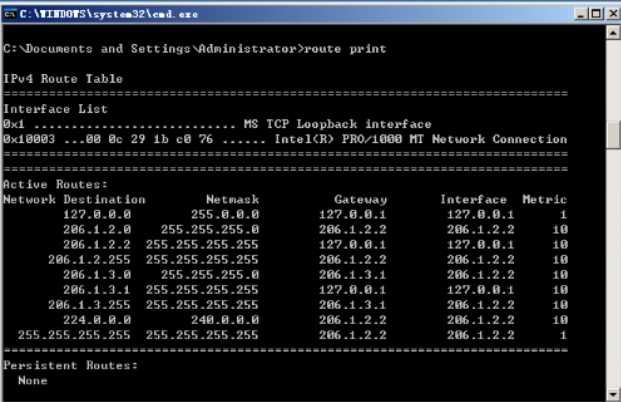
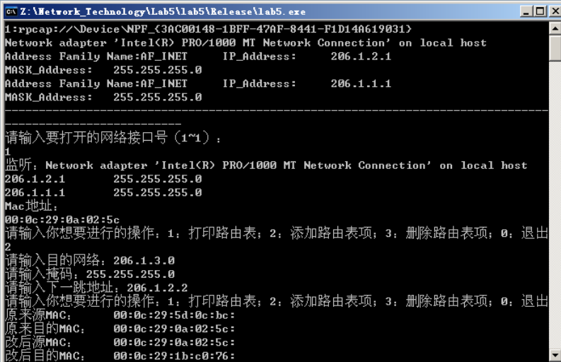
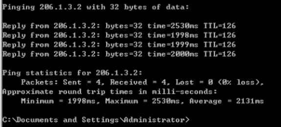

# 网络技术课程实验报告

<center>实验五</center>


<center>实验名称：简单路由器程序的设计</center>

<center>梁晓储 2110951</center>

<center>专业：物联网工程</center>

<center>提交日期：2023.12.23</center>


## 一、实验要求

1. 设计和实现一个路由器程序，要求完成的路由器程序能和现有的路由器产品（如思科路由器、华为路由器、微软的路由器等）进行协同工作。

2. 程序可以仅实现IP数据报的获取、选路、投递等路由器要求的基本功能。可以忽略分片处理、选项处理、动态路由表生成等功能。

3. 需要给出路由表的手工插入、删除方法。

4. 需要给出路由器的工作日志，显示数据报获取和转发过程。

5. 完成的程序须通过现场测试，并在班（或小组）中展示和报告自己的设计思路、开发和实现过程、测试方法和过程。


## 二、实验流程

1. 首先获取网络设备列表及其信息，随后打开用户所选择的网络设备。
2. 使用Arp方式获取本机MAC地址，并且初始化路由表（将相邻的两个网段添加进路由表中）
3. 构建一个线程，用于接收信息和转发信息。
4. 进入循环，开始实验内容（选择打印路由表，手动添加路由表，删除路由表，退出）
5. 在接收消息中，筛选IP类型的消息，丢弃ARP类型。获取消息的MAC地址，如果消息的目的MAC地址不是 本机，则丢弃，如果目的MAC地址以及目的IP地址全部指向自己，则接收，如果目的MAC地址是本机，IP地址不是本机，则转发。之后查找路由表的对应的下一步IP，若没找到，则丢弃；若找到，则进行下一步。之后查看ARP表，看是否有下一跳IP地址的MAC地址，若没有，则发送ARP请求获取MAC地址，若有，直接返回。
6. 之后进行组装报文，对于接收到的信息进行修改，将SrcMAC变为本机的MAC，将DesMAC变为下一跳的MAC。若TTL=0，则返回报文，不转发。若TTL>0，则-1，重新计算校验和。


## 代码分析

### 报文格式

```c++
typedef struct FrameHeader_t {		//帧首部
	BYTE DesMAC[6];//目的地址
	BYTE SrcMAC[6];//源地址
	WORD FrameType;//帧类型
}FrameHeader_t;

typedef struct IPHeader_t {		//IP首部
	BYTE Ver_HLen;//IP协议版本和IP首部长度：高4位为版本，低4位为首部的长度
	BYTE TOS;//服务类型
	WORD TotalLen;//总长度
	WORD ID;//标识
	WORD Flag_Segment;//标志 片偏移
	BYTE TTL;//生存周期
	BYTE Protocol;//协议
	WORD Checksum;//头部校验和
	u_int SrcIP;//源IP
	u_int DstIP;//目的IP
}IPHeader_t;

typedef struct ARPFrame_t {
	FrameHeader_t FrameHeader;
	WORD HardwareType;//硬件类型
	WORD ProtocolType;//协议类型
	BYTE HLen;//硬件地址长度
	BYTE PLen;//协议地址长度
	WORD Operation;//操作类型
	BYTE SendHa[6];//发送方MAC地址
	DWORD SendIP;//发送方IP地址
	BYTE RecvHa[6];//接收方MAC地址
	DWORD RecvIP;//接收方IP地址
}ARPFrame_t;

typedef struct Data_t {		//数据包
	FrameHeader_t FrameHeader;
	IPHeader_t IPHeader;
}Data_t;

typedef struct ICMP {//ICMP报文
	FrameHeader_t FrameHeader;
	IPHeader_t IPHeader;
	char buf[0x80];
}ICMP_t;
```

报文首部、IP报文首部、ARP报文格式、数据包以及ICMP报文格式。


### 存储结构

- 路由表项

```c++
class RouterItem//路由表表项
{
public:
	DWORD mask;//掩码
	DWORD net;//目的网络
	DWORD nextip;//下一跳
	BYTE nextmac[6];
	int index;//第几条
	int type;//0为直接连接，1为用户添加
	RouterItem* nextitem;//采用链表形式存储
	RouterItem()
	{
		memset(this, 0, sizeof(*this));//全部初始化为0
	}
	void PrintItem()//打印表项内容：掩码、目的网络、下一跳IP、类型
	{
		in_addr addr;
		printf("%d ", index);
		addr.s_addr = mask;
		char* temp = inet_ntoa(addr);
		printf("%s\t", temp);
		addr.s_addr = net;
		temp = inet_ntoa(addr);
		printf("%s\t", temp);
		addr.s_addr = nextip;
		temp = inet_ntoa(addr);
		printf("%s\t", temp);
		printf("%d\n", type);
	}
};
```

定义路由表表项，一个表项包含掩码、目的网络、下一跳IP，以及表项类型等。路由表表项 
采用链表的形式存储。并且定义Print函数，用于打印表项内容：掩码、目的网络、下一跳 
IP、类型


- 路由表

```c++
class RouterTable//路由表
{
public:
	RouterItem* head, * tail;
	int num;//条数
	RouterTable()//初始化，添加直接相连的网络
	{
		head = new RouterItem;
		tail = new RouterItem;
		head->nextitem = tail;
		num = 0;
		for (int i = 0; i < 2; i++)
		{
			RouterItem* temp = new RouterItem;
			temp->net = (inet_addr(ip[i])) & (inet_addr(mask[i]));//本机网卡的ip和掩码进行按位与即为所在网络
			temp->mask = inet_addr(mask[i]);
			temp->type = 0;//0表示直接连接，不可删除
			this->RouterAdd(temp);
		}
	}
	void RouterAdd(RouterItem* a)//路由表的添加
	{
		RouterItem* pointer;
		if (!a->type)
		{
			a->nextitem = head->nextitem;
			head->nextitem = a;
			a->type = 0;
		}
		else//按照掩码由长至短找到合适的位置
		{
			for (pointer = head->nextitem; pointer != tail && pointer->nextitem != tail; pointer = pointer->nextitem)
			{
				if (a->mask < pointer->mask && a->mask >= pointer->nextitem->mask || pointer->nextitem == tail)
				{
					break;
				}
			}
			a->nextitem = pointer->nextitem;
			pointer->nextitem = a;
		}
		RouterItem* p = head->nextitem;
		for (int i = 0; p != tail; p = p->nextitem, i++)
		{
			p->index = i;
		}
		num++;
	}
	void RouterRemove(int index)//路由表的删除
	{
		for (RouterItem* t = head; t->nextitem != tail; t = t->nextitem)
		{
			if (t->nextitem->index == index)
			{
				if (t->nextitem->type == 0)
				{
					printf("该项不可删除\n");
					return;
				}
				else
				{
					t->nextitem = t->nextitem->nextitem;
					return;
				}
			}
		}
		printf("无该表项\n");
	}
	void print()
	{
		for (RouterItem* p = head->nextitem; p != tail; p = p->nextitem)
		{
			p->PrintItem();
		}
	}
	DWORD RouterFind(DWORD ip)//查找最长前缀，返回下一跳的ip
	{
		for (RouterItem* t = head->nextitem; t != tail; t = t->nextitem)
		{
			if ((t->mask & ip) == t->net)
			{
				return t->nextip;
			}
		}
		return -1;
	}
};
```

路由表内包含了多个路由表项（以链表形式存储）。开始进行初始化，添加直接相连的网络。定义路由表的添加、删除、打印以及查找函数。

在添加函数中，首先判断路由表项类型，若为0，则直接投递，加入路由表；若为1，则为手动添加，则按照掩码由长到短进行添加。

在删除函数中，首先判断路由表类型，若为0，则不可删除；若为1，则直接删除。打印函数中，遍历路由表，依次删除路由表中的路由表项的信息。查找函数中，遍历路由表，查找最长前缀，返回下一跳的ip。


- ARP缓存表

```c++
class ArpTable//ARP表（将IP和MAC的对应关系存储在一张表里）
{
public:
	DWORD ip;
	BYTE mac[6];
	static int num;
	static void InsertArp(DWORD ip, BYTE mac[6])
	{
		arptable[num].ip = ip;
		GetOtherMac(ip, arptable[num].mac);
		memcpy(mac, arptable[num].mac, 6);
		num++;
	}
	static int FindArp(DWORD ip, BYTE mac[6])
	{
		memset(mac, 0, 6);
		for (int i = 0; i < num; i++)
		{
			if (ip == arptable[i].ip)
			{
				memcpy(mac, arptable[i].mac, 6);
				return 1;
			}
		}
		return 0;
	}
}arptable[50];
```

为减少发送ARP请求的次数，将IP和MAC的对应关系存储在一张表里

在实际情况中需要设置表项的生命周期，防止一段时间后个别表项IP和MAC出现不对应的情况，本次实验较为简单，故没有设置。

在ARP表中，存储了IP以及MAC之间的对应关系，定义了插入以及查找函数。在插入函数中，使用GetOtherMac函数获取IP地址对应的MAC地址。在查找函数中，遍历ARP表进行查找。


- 日志输出

```c++
class Routerlog //日志
{
public:
	int index;//索引
	char type[5];//类型（arp ip）
	ipitem ip;
	arpitem arp;
	Routerlog()
	{
		fp = fopen("log.txt", "a+");//文件以及打开方式
	}
	~Routerlog()
	{
		fclose(fp);
	}
	static int num;
	static Routerlog diary[50];
	static FILE* fp;
	static void WritelogARP(ARPFrame_t* t)
	{
		fprintf(fp, "ARP\t");
		in_addr addr;
		addr.s_addr = t->SendIP;
		char* temp = inet_ntoa(addr);
		fprintf(fp, "IP:\t");
		fprintf(fp, "%s\t", temp);
		fprintf(fp, "MAC:\t");
		for (int i = 0; i < 6; i++)
		{
			fprintf(fp, "%02x:", t->SendHa[i]);
		}
		fprintf(fp, "\n");
		//printf("end\n");
	}
	static void WritelogIP(const char* a, Data_t* t)
	{
		fprintf(fp, "IP\t");
		fprintf(fp, a);
		fprintf(fp, "\t");
		in_addr addr;
		addr.s_addr = t->IPHeader.SrcIP;
		char* temp = inet_ntoa(addr);
		fprintf(fp, "源IP：\t");
		fprintf(fp, "%s\t", temp);
		fprintf(fp, "目的IP：\t");
		addr.s_addr = t->IPHeader.DstIP;
		fprintf(fp, "%s\t", temp);
		fprintf(fp, "源MAC：\t");
		for (int i = 0; i < 6; i++)
			fprintf(fp, "%02x:", t->FrameHeader.SrcMAC[i]);
		fprintf(fp, "目的MAC：\t");
		for (int i = 0; i < 6; i++)
			fprintf(fp, "%02x:", t->FrameHeader.DesMAC[i]);
		fprintf(fp, "\n");
		//printf("end\n");
	}
	static void print()
	{
		for (int i = 0; i < num; i++)
		{
			printf("%d ", diary[i].index);
			printf("%s\t ", diary[i].type);
			if (strcmp(diary[i].type, "ARP") == 0)
			{
				in_addr addr;
				addr.s_addr = diary[i].arp.ip;
				char* temp = inet_ntoa(addr);
				printf("%s\t", temp);
				for (int i = 0; i < 6; i++)
				{
					printf("%02x.", diary[i].arp.mac[i]);
				}
				//fprintf(fp, "/n");
				//printf("end\n");
			}
			else if (strcmp(diary[i].type, "IP") == 0)
			{
				in_addr addr;
				addr.s_addr = diary[i].ip.sip;
				char* temp = inet_ntoa(addr);
				printf("源IP：%s\t", temp);
				addr.s_addr = diary[i].ip.dip;
				temp = inet_ntoa(addr);
				printf("目的IP：%s\t", temp);
				printf("源MAC: ");
				for (int i = 0; i < 6; i++)
				{
					printf("%02x.", diary[i].ip.smac[i]);
				}
				printf("目的MAC: ");
				for (int i = 0; i < 6; i++)
				{
					printf("%02x.", diary[i].ip.dmac[i]);
				}
				//fprintf(fp, "/n");
				//printf("end\n");
			}
		}
	}
};
```


### 主要代码

- GetOtherMac()

与获取本机MAC地址类似，后面会介绍，本处不再赘述。区别在于将ARPFrame.RecvIP设置为新请求的IP地址

```c++
void GetOtherMac(DWORD ip0, BYTE mac[])
{
	memset(mac, 0, sizeof(mac));
	ARPFrame_t ARPFrame;
	//将APRFrame.FrameHeader.DesMAC设置为广播地址
	for (int i = 0; i < 6; i++)
		ARPFrame.FrameHeader.DesMAC[i] = 0xff;
	//将APRFrame.FrameHeader.SrcMAC设置为本机网卡的MAC地址
	for (int i = 0; i < 6; i++)
	{
		ARPFrame.FrameHeader.SrcMAC[i] = selfmac[i];
		ARPFrame.SendHa[i] = selfmac[i];
	}
	ARPFrame.FrameHeader.FrameType = htons(0x0806);//帧类型为ARP
	ARPFrame.HardwareType = htons(0x0001);//硬件类型为以太网
	ARPFrame.ProtocolType = htons(0x0800);//协议类型为IP
	ARPFrame.HLen = 6;//硬件地址长度为6
	ARPFrame.PLen = 4;//协议地址长为4
	ARPFrame.Operation = htons(0x0001);//操作为ARP请求
	//将ARPFrame.SendIP设置为本机网卡上绑定的IP地址
	ARPFrame.SendIP = inet_addr(ip[0]);
	//将ARPFrame.RecvHa设置为0
	for (int i = 0; i < 6; i++)
	{
		ARPFrame.RecvHa[i] = 0;
	}
	//将ARPFrame.RecvIP设置为请求的IP地址
	ARPFrame.RecvIP = ip0;
	if (adhandle == nullptr)
	{
		printf("网卡接口打开错误\n");
	}
	else
	{
		if (pcap_sendpacket(adhandle, (u_char*)&ARPFrame, sizeof(ARPFrame_t)) != 0)
		{
			//发送错误处理
			printf("发送错误\n");
			return;
		}
		else
		{
			//发送成功
			while (1)
			{
				pcap_pkthdr* pkt_header;
				const u_char* pkt_data;
				int rtn = pcap_next_ex(adhandle, &pkt_header, &pkt_data);
				//pcap_sendpacket(ahandle, (u_char*)&ARPFrame, sizeof(ARPFrame_t));
				if (rtn == 1)
				{
					ARPFrame_t* IPPacket = (ARPFrame_t*)pkt_data;
					if (ntohs(IPPacket->FrameHeader.FrameType) == 0x0806)
					{//输出目的MAC地址
						if (ntohs(IPPacket->Operation) == 0x0002)//如果帧类型为ARP并且操作为ARP应答
						{
							LT.WritelogARP(IPPacket);
							//输出源MAC地址
							for (int i = 0; i < 6; i++)
								mac[i] = IPPacket->FrameHeader.SrcMAC[i];
							break;
						}
					}
				}
			}
		}
	}
}
```


- SetCheckSum(Data_t* temp),CheckSum

设置校验和，首先设置为0，之后每16位为一组，逐项相加，如果溢出，则进行回卷，最后结果取反，即可得到检验和。

检验校验和类似，最后进行即可

```c++
void SetCheckSum(Data_t* temp)
{
	temp->IPHeader.Checksum = 0;
	unsigned int sum = 0;
	WORD* t = (WORD*)&temp->IPHeader;//每16位为一组
	for (int i = 0; i < sizeof(IPHeader_t) / 2; i++)
	{
		sum += t[i];
		while (sum >= 0x10000)//如果溢出，则进行回卷
		{
			int s = sum >> 16;
			sum -= 0x10000;
			sum += s;
		}
	}
	temp->IPHeader.Checksum = ~sum;//结果取反
}

bool CheckSum(Data_t* temp)
{
	unsigned int sum = 0;
	WORD* t = (WORD*)&temp->IPHeader;
	for (int i = 0; i < sizeof(IPHeader_t) / 2; i++)
	{
		sum += t[i];
		while (sum >= 0x10000)//如果溢出，则进行回卷
		{
			int s = sum >> 16;
			sum -= 0x10000;
			sum += s;
		}
	}
	if (sum == 65535)
	{
		return 1;
	}
	else
	{
		return 0;
	}
}
```


- DWORD WINAPI Thread(LPVOID lparam)

为使消息转发和路由表添加、删除、打印等操作可以同时进行，使用线程函数进行消息内容处理

```c++
DWORD WINAPI Thread(LPVOID lparam)
{
	RouterTable RT = *(RouterTable*)(LPVOID)lparam;
	while (1)
	{
		pcap_pkthdr* pkt_header;
		const u_char* pkt_data;
		while (1)
		{
			int rtn = pcap_next_ex(adhandle, &pkt_header, &pkt_data);
			if (rtn)//接收到消息
			{
				break;
			}
		}
		FrameHeader_t* header = (FrameHeader_t*)pkt_data;
		if (Compare(header->DesMAC, selfmac))//目的mac是自己的mac
		{
			if (ntohs(header->FrameType) == 0x0806)//收到ARP
			{
				//do nothing
			}
			else if (ntohs(header->FrameType) == 0x0800)//收到IP
			{
				Data_t* data = (Data_t*)pkt_data;
				LT.WritelogIP("接收", data);
				DWORD dstip = data->IPHeader.DstIP;
				DWORD IFip = RT.RouterFind(dstip);//查找是否有对应表项
				if (IFip == -1)
				{
					continue;
				}
				if (CheckSum(data))//如果校验和不正确，则直接丢弃不进行处理
				{
					if (data->IPHeader.DstIP != inet_addr(ip[0]) && data->IPHeader.DstIP != inet_addr(ip[1]))
					{
						int t1 = Compare(data->FrameHeader.DesMAC, broadcast);
						int t2 = Compare(data->FrameHeader.SrcMAC, broadcast);
						if (!t1 && !t2)
						{
							//ICMP报文包含IP数据包报头和其它内容
							ICMP_t* temp_ = (ICMP_t*)pkt_data;
							ICMP_t temp = *temp_;
							BYTE mac[6];
							if (IFip == 0)
							{
								//如果ARP表中没有所需内容，则需要获取ARP
								if (!ArpTable::FindArp(dstip, mac))
								{
									ArpTable::InsertArp(dstip, mac);
								}
								resend(temp, mac);
							}

							else if (IFip != -1)//非直接投递，查找下一条IP的MAC
							{
								if (!ArpTable::FindArp(IFip, mac))
								{
									ArpTable::InsertArp(IFip, mac);
								}
								resend(temp, mac);
							}
						}
					}
				}
			}
		}
	}
}
```


- resend(ICMP_t data, BYTE desmac[])

消息转发函数中，设置源MAC为本机MAC，目的MAC为下一跳MAC。之后重新设置校验和，发送数据包

```c++
void resend(ICMP_t data, BYTE desmac[])
{
	printf("原来源MAC：\t");
	for (int i = 0; i < 6; i++)
		printf("%02x:", data.FrameHeader.SrcMAC[i]);
	printf("\n");
	printf("原来目的MAC：\t");
	for (int i = 0; i < 6; i++)
		printf("%02x:", data.FrameHeader.DesMAC[i]);
	printf("\n");
	Data_t* temp = (Data_t*)&data;
	memcpy(temp->FrameHeader.SrcMAC, temp->FrameHeader.DesMAC, 6);//源MAC为本机MAC
	memcpy(temp->FrameHeader.DesMAC, desmac, 6);//目的MAC为下一跳MAC

	printf("改后源MAC：\t");
	for (int i = 0; i < 6; i++)
		printf("%02x:", temp->FrameHeader.SrcMAC[i]);
	printf("\n");

	printf("改后目的MAC：\t");
	for (int i = 0; i < 6; i++)
		printf("%02x:", temp->FrameHeader.DesMAC[i]);
	printf("\n");


	temp->IPHeader.TTL -= 1;
	if (temp->IPHeader.TTL < 0)
	{
		return;
	}
	SetCheckSum(temp);//重新设置校验和
	int rtn = pcap_sendpacket(adhandle, (const u_char*)temp, 74);//发送数据报
	if (rtn == 0)
	{
		LT.WritelogIP("转发", temp);
	}
}
```


## 实验结果

首先按照实验手册上面为3号设备添加路由表



随后在2号设备运行本路由程序



最后在作为主机的两台设备上进行ping操作



可以看到TTL正确并且可以ping通


## 相关问题

### **ARP相关**

第一次使用arp是在获取本机的mac地址的时候 往后和ARP相关的操作就是在线程函数中 如果接收到一个不是广播且校验和正确的数据包，当它的目的IP不是本机的IP时，就会查询ARP缓存表获取下一跳的MAC，如果缓存表没有对应的IP-MAC映射关系，就会发送ARP获取这个IP对应的MAC地址，存储进缓存表中。 

 

### **数据包转发流程** 

转发函数主要是resend()，这个函数的参数是数据包和下一跳MAC地址 函数首先打印出原始数据包的源 MAC 地址和目的 MAC 地址，接着将源 MAC 地址设置为本机的 MAC 地址，将目的 MAC 地址设置为下一跳的 MAC 地址，随后再次打印修改后的源 MAC 地址和目的 MAC 地址 接下来，函数将 IP 数据包的 TTL 减 1，并检查 TTL 是否小于 0。如果 TTL 小于 0，则停止转发该数据包。否则，函数调用 SetCheckSum() 函数重新计算 IP 数据包的校验和。 最后，函数调用 pcap_sendpacket() 函数将修改后的数据包发送 


### **路由表查找** 

路由表查找的过程也在线程函数中，当收到一个IP包的时候，就会去路由表中查找是否有对应表项。 主要是RouterFind()，函数首先遍历整个路由表，对于每一个路由项，它会判断该路由项的网络地址是否与给定的IP地址进行按位与操作后相等。如果相等，说明该路由项的网络地址是给定IP地址的最长前缀 当找到匹配的路由项时，函数会返回该路由项的下一跳IP地址，即要将数据包发送到的目标地址 如果整个路由表中都没有匹配的路由项，函数会返回-1，表示找不到合适的下一跳地址
