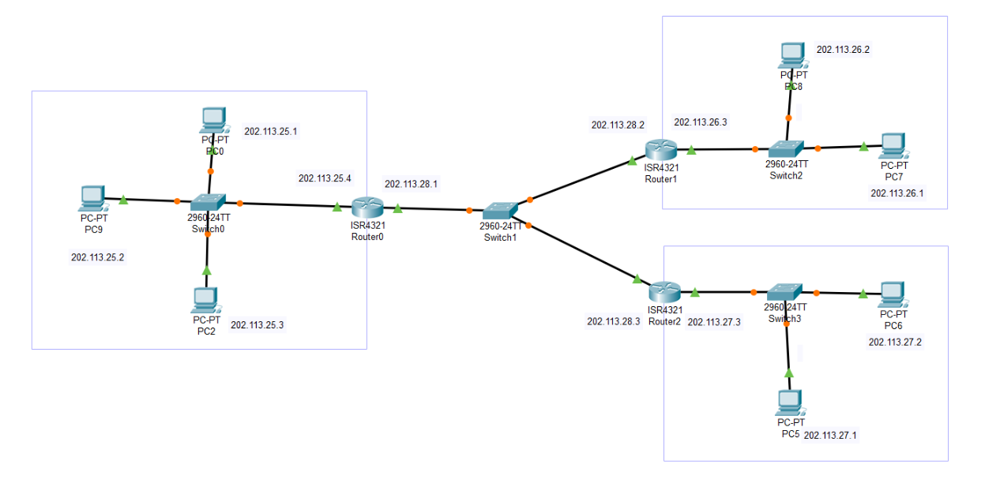

# 网络技术课程实验报告

<center>实验七</center>


<center>实验名称：防火墙和SSL实验</center>

<center>梁晓储 2110951</center>

<center>专业：物联网工程</center>

<center>提交日期：2023.12.17</center>


## 一、实验要求

- 防火墙实验

防火墙实验在虚拟仿真环境下完成，要求如下：

1. 了解包过滤防火墙的基本配置方法、配置命令和配置过程。
2. 利用标准ACL，将防火墙配置为只允许某个网络中的主机访问另一个网络。
3. 利用扩展ACL，将防火墙配置为拒绝某个网络中的某台主机访问网络中的Web服务器。
4. 将防火墙配置为允许内网用户自由地向外网发起TCP连接，同时可以接收外网发回的TCP应答数据包。但是，不允许外网的用户主动向内网发起TCP连接。


- SSL实验（选做）

SSL实验在实体环境下完成，要求如下：

1. 完成Web服务器的证书生成、证书审批、证书安装、证书允许等整个过程。
2. 实现浏览器与Web服务器的安全通信。


## 二、仿真环境下的互联网组网与路由器配置

### 实验基础配置与拓扑图

实验由14台设备组成，其中`PC0、PC2、PC9`为网络`A`主机，`PC7、PC8`为网络`B`主机，`PC5、PC6`为网络`C`主机。拓扑结构如下：




配置各设备端口IP地址及路由如下：

 - 主机`PC0`

   IP：202.113.25.1/24 默认网关：202.113.25.4/24

 - 主机`PC2`

   IP：202.113.25.3/24 默认网关：202.113.25.4/24

 - 主机`PC9`

   IP：202.113.25.2/24 默认网关：202.113.25.4/24

 - 主机`PC7`

   IP：202.113.26.1/24 默认网关：202.113.26.3/24

 - 主机`PC8`

   IP：202.113.26.2/24 默认网关：202.113.26.3/24

 - 主机`PC5`

   IP：202.113.27.1/24 默认网关：202.113.27.3/24

 - 主机`PC6`

   IP：202.113.27.2/24 默认网关：202.113.27.3/24

 - 服务器`Server0`

   IP：202.113.25.2/24 默认网关：202.113.25.4/24


### **标准ACL配置过程**

利用IP数据报中的源IP地址对过往数据包进行控制，列表号范围：1~99

使网络B中的主机可以自由访问网络A，而其他网络不可访问网络A


对路由器`R0`配置步骤如下

- 建立标准控制列表指定能够通过的`IP`地址，在全局配置模式下进行：

  ```shell
  access-list 6 permit 202.113.26.0 0.0.0.255
  ```

  创建了序号为`6`的访问控制列表，允许`202.113.26.0`开始的地址通过，注意此处的通配符与掩码相反，能够改变的位为1，不能改变的位为0。

  

- 再在该ACL中增加一条规则：

  ```shell
  access-list 6 deny any
  ```

  拒绝其他所有IP地址通过，达到了仅允许`202.113.26.0`开始的地址通过的目的。

  

- 进入接口配置模式，将ACL绑定到路由器进入`202.113.26.0`的方向：

  ```sh
  interface gig0/1
  ip access-group 6 in
  exit
  ```

  将序号为`6`的访问控制列表绑定到路由器`gig0/1`端口进入方向。


### **扩展ACL配置过程**

按照协议类型、源IP地址、目的IP地址、源端口号、目的端口号对过往数据包进行控制，列表号范围：101~199

不允许IP地址为`202.113.26.2`的主机访问地址为`202.113.25.2`的服务器的Web服务，允许其他任何主机访问


对路由器`R0`配置步骤如下：

- 建立标准控制列表指定不能够通过的`IP`地址，在全局配置模式下进行：

```sh
access-list 106 deny tcp host 202.113.26.2 host 202.113.25.2 eq 80
```

创建了序号为`106`的访问控制列表，不允许`202.113.26.2`的地址通过`TCP`协议中`80`端口进行访问，`host`为单个主机关键字，`eq`表示等于，注意此处要写明源主机和目的主机。


- 再在该ACL中增加一条规则：

```sh
access-list 106 permit ip any any
```

允许其他所有IP数据报通过，达到了仅不允许`202.113.26.2`开始的地址通过`TCP`协议访问的目的。


- 进入接口配置模式，将ACL绑定到路由器进入`202.113.26.0`的方向：

```sh
interface gig0/1
ip access-group 106 in
exit
```

将序号为`106`的访问控制列表绑定到路由器`gig0/1`端口进入方向。


## 三、实验结果

- 仿真环境下，主机`PC8`对主机`PC2`发送`ping`命令：

可以`ping`通。


- 仿真环境下，主机`PC6`对主机`PC2`发送`ping`命令：

不可`ping`通，且显示不可达。


- 仿真环境下，主机`PC8`对服务器`Server0`Web页面进行访问：

页面不可显示，访问失败


- 仿真环境下，主机`PC7`对服务器`Server0`Web页面进行访问：

页面可显示，访问成功。


- 仿真环境下，主机`PC8`对服务器`Server0`发送`ping`命令：

可以`ping`通，表明路由器只限制了`TCP`协议端口号为`80`的数据报通过。


