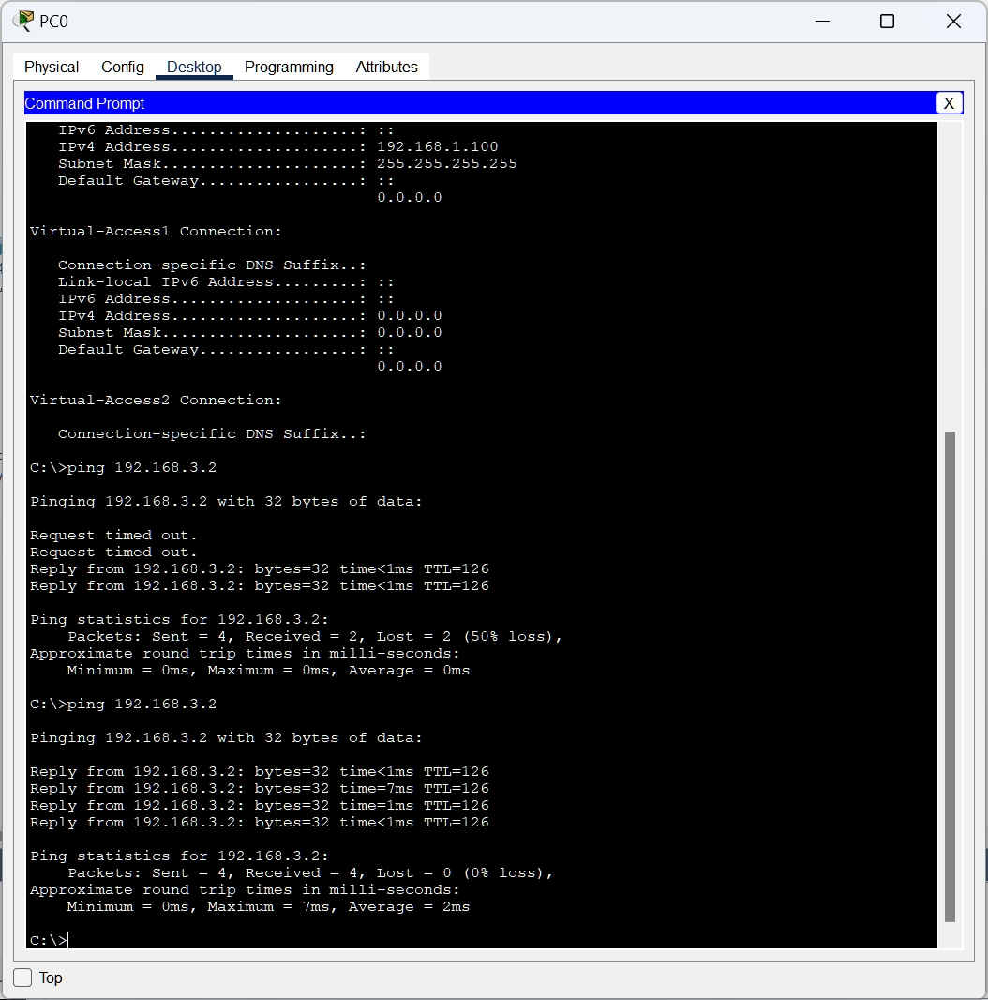

# 网络技术课程实验报告

<center>实验八</center>


<center>实验名称：PPPoE服务器的配置和应用</center>

<center>梁晓储 2110951</center>

<center>专业：物联网工程</center>

<center>提交日期：2023.12.19</center>


## 一、实验要求

- PPPoE服务器配置和应用实验在虚拟仿真环境下完成，要求如下：

1. 仿真有线局域网接入互联网的场景，正确配置PPPoE服务器的认证协议、地址池、虚拟模板和物理接口，使内网用户经认证后才能正常访问外部互联网。
2. 仿真家庭网络中，无线和有线终端（主机、智能电话等）连入小型路由器，由小型路由器统一接入互联网服务运营商PPPoE服务器的场景。对小型路由器和PPPoE服务器进行设置，使家庭网络中的用户经认证后才能正常访问外部互联网。


## 二、仿真环境下的互联网组网与路由器配置

### 实验基础配置与拓扑图


PC0和PC1的IP地址方式改为DHCP动态获取，其余主机配置如下：

| 主机      | 掩码          | IP          | 网关        |
| --------- | ------------- | ----------- | ----------- |
| PC2       | 255.255.255.0 | 192.168.3.2 | 192.168.3.1 |
| AAAServer | 255.255.255.0 | 192.168.2.3 | 192.168.2.1 |
| WebServer | 255.255.255.0 | 192.168.3.3 | 192.168.3.1 |

打开路由器，配置IP如下

| 路由器  | 端口               | 掩码          | IP地址                       |
| ------- | ------------------ | ------------- | ---------------------------- |
| 路由器0 | gig0/0<br />gig0/1 | 255.255.255.0 | 192.168.2.1<br />192.168.1.1 |
| 路由器1 | gig0/0<br />gig0/1 | 255.255.255.0 | 192.168.2.2<br />192.168.3.1 |

接着配置每个路由的RIP动态路由。


### 仿真有线局域网配置过程

配置路由器0

启动路由器认证授权：

```shell
aaa new-model
```

建立PPPoE认证方式：

```shell
aaa authentication ppp myPPPoE group radius
```

配置AAA服务器：

```shell
radius-server host 192.168.2.3 auth-port 1645 key radius123
```


AAA服务器配置如下


下面继续配置路由器。

配置本地地址池：

```shell
ip local pool myPool 192.168.1.100 192.168.1.200
```

配置虚拟模板：

```shell
interface virtual-template 1
ip unnumber gig0/1
peer default ip address pool myPool
ppp authentication chap myPPPoE
exit
```

创建BBA组：

```shell
bba-group pppoe myBBAGroup
virtual-template 1
exit
```

启动PPPoE功能：

```she;;
interface gig0/1
pppoe enable group myBBAGroup
exit
```

### 

### 仿真家庭网络配置

PC3、笔记本电脑0、智能手机0的IP地址均为DHCP自动分配。其余配置与前面相同。

无线路由器1配置如下


其余配置与上一实验相同

## 三、实验结果

### 仿真有线局域网

- 使用PC0的PPPoE拨号功能：


- 检查PC0的IP地址，为192.168.1.100：


- 使用PC0尝试ping主机，访问Web服务器：




### 仿真家庭网络

- 使用笔记本电脑ping PC2：


可以发现TTL为`125`，经过三个路由器。

- 尝试访问Web服务器，可以访问：


## PPPoE相关

### 发现阶段

这个阶段会发送两个类型的包：PADI（PPPoE Active Discovery Initiation）包和PADO（PPPoE Active Discovery Offer）包。

1. PADI包：PADI包是由客户端发送的广播包，用于在局域网中寻找可用的PPPoE服务器。该包包含了客户端的MAC地址和希望连接的服务名称（Service Name）。
2. PADO包：当有PPPoE服务器收到PADI包后，如果有可用的连接资源，它会回应一个PADO包。PADO包是单播包，目标地址是客户端的MAC地址。PADO包中包含了服务器的MAC地址、服务名称和其他相关参数。

PADI 包是由主机（通常是路由器）通过广播方式发送的，而 PADO 包是由 PPPoE 服务器单播回复给主机的。

具体来说，当主机要建立一个 PPPoE 连接时，它会在本地网络中广播一个 PADI 包，该包包含了主机的 MAC 地址和希望连接的服务名称。当 PPPoE 服务器收到 PADI 包后，如果有可用的连接资源，它会回复一个 PADO 包，该包包含了服务器的 MAC 地址、服务名称和其他相关参数，并使用单播方式将该包发送到主机。

### 会话阶段

- 获得PPPoE服务器分配的会话ID后,进入会话阶段
- 会话ID在会话阶段保持不变(与源MAC地址结合可识别用户)
- 会话阶段包括了PPP协议的LCP处理、NCP处理以及身份认证处理等过程
- 所有PPP数据包封装在以太网帧中传递
